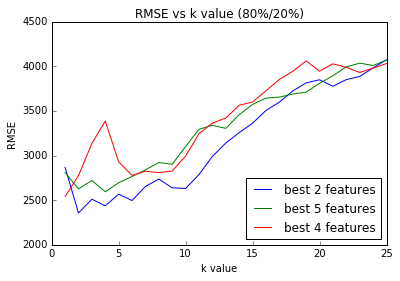
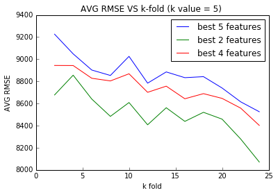

# Preparing Data


```python
import pandas as pd
import numpy as np
cars = pd.read_csv("imports-85.data")
cars.head()
```


<div>
<table border="1" class="dataframe">
  <thead>
    <tr style="text-align: right;">
      <th></th>
      <th>3</th>
      <th>?</th>
      <th>alfa-romero</th>
      <th>gas</th>
      <th>std</th>
      <th>two</th>
      <th>convertible</th>
      <th>rwd</th>
      <th>front</th>
      <th>88.60</th>
      <th>...</th>
      <th>130</th>
      <th>mpfi</th>
      <th>3.47</th>
      <th>2.68</th>
      <th>9.00</th>
      <th>111</th>
      <th>5000</th>
      <th>21</th>
      <th>27</th>
      <th>13495</th>
    </tr>
  </thead>
  <tbody>
    <tr>
      <th>0</th>
      <td>3</td>
      <td>?</td>
      <td>alfa-romero</td>
      <td>gas</td>
      <td>std</td>
      <td>two</td>
      <td>convertible</td>
      <td>rwd</td>
      <td>front</td>
      <td>88.6</td>
      <td>...</td>
      <td>130</td>
      <td>mpfi</td>
      <td>3.47</td>
      <td>2.68</td>
      <td>9.0</td>
      <td>111</td>
      <td>5000</td>
      <td>21</td>
      <td>27</td>
      <td>16500</td>
    </tr>
    <tr>
      <th>1</th>
      <td>1</td>
      <td>?</td>
      <td>alfa-romero</td>
      <td>gas</td>
      <td>std</td>
      <td>two</td>
      <td>hatchback</td>
      <td>rwd</td>
      <td>front</td>
      <td>94.5</td>
      <td>...</td>
      <td>152</td>
      <td>mpfi</td>
      <td>2.68</td>
      <td>3.47</td>
      <td>9.0</td>
      <td>154</td>
      <td>5000</td>
      <td>19</td>
      <td>26</td>
      <td>16500</td>
    </tr>
    <tr>
      <th>2</th>
      <td>2</td>
      <td>164</td>
      <td>audi</td>
      <td>gas</td>
      <td>std</td>
      <td>four</td>
      <td>sedan</td>
      <td>fwd</td>
      <td>front</td>
      <td>99.8</td>
      <td>...</td>
      <td>109</td>
      <td>mpfi</td>
      <td>3.19</td>
      <td>3.40</td>
      <td>10.0</td>
      <td>102</td>
      <td>5500</td>
      <td>24</td>
      <td>30</td>
      <td>13950</td>
    </tr>
    <tr>
      <th>3</th>
      <td>2</td>
      <td>164</td>
      <td>audi</td>
      <td>gas</td>
      <td>std</td>
      <td>four</td>
      <td>sedan</td>
      <td>4wd</td>
      <td>front</td>
      <td>99.4</td>
      <td>...</td>
      <td>136</td>
      <td>mpfi</td>
      <td>3.19</td>
      <td>3.40</td>
      <td>8.0</td>
      <td>115</td>
      <td>5500</td>
      <td>18</td>
      <td>22</td>
      <td>17450</td>
    </tr>
    <tr>
      <th>4</th>
      <td>2</td>
      <td>?</td>
      <td>audi</td>
      <td>gas</td>
      <td>std</td>
      <td>two</td>
      <td>sedan</td>
      <td>fwd</td>
      <td>front</td>
      <td>99.8</td>
      <td>...</td>
      <td>136</td>
      <td>mpfi</td>
      <td>3.19</td>
      <td>3.40</td>
      <td>8.5</td>
      <td>110</td>
      <td>5500</td>
      <td>19</td>
      <td>25</td>
      <td>15250</td>
    </tr>
  </tbody>
</table>
<p>5 rows × 26 columns</p>
</div>


```python
# It seems that the dataset does not include the columns so need to add them in
columns = ['symboling', 'normalized-losses', 'make', 'fuel-type', 'aspiration', 'num-of-doors', 'body-style', 
        'drive-wheels', 'engine-location', 'wheel-base', 'length', 'width', 'height', 'curb-weight', 'engine-type', 
        'num-of-cylinders', 'engine-size', 'fuel-system', 'bore', 'stroke', 'compression-rate', 'horsepower', 'peak-rpm', 'city-mpg', 'highway-mpg', 'price']

cars = pd.read_csv("imports-85.data", names=columns)
cars.head()
```


<div>
<table border="1" class="dataframe">
  <thead>
    <tr style="text-align: right;">
      <th></th>
      <th>symboling</th>
      <th>normalized-losses</th>
      <th>make</th>
      <th>fuel-type</th>
      <th>aspiration</th>
      <th>num-of-doors</th>
      <th>body-style</th>
      <th>drive-wheels</th>
      <th>engine-location</th>
      <th>wheel-base</th>
      <th>...</th>
      <th>engine-size</th>
      <th>fuel-system</th>
      <th>bore</th>
      <th>stroke</th>
      <th>compression-rate</th>
      <th>horsepower</th>
      <th>peak-rpm</th>
      <th>city-mpg</th>
      <th>highway-mpg</th>
      <th>price</th>
    </tr>
  </thead>
  <tbody>
    <tr>
      <th>0</th>
      <td>3</td>
      <td>?</td>
      <td>alfa-romero</td>
      <td>gas</td>
      <td>std</td>
      <td>two</td>
      <td>convertible</td>
      <td>rwd</td>
      <td>front</td>
      <td>88.6</td>
      <td>...</td>
      <td>130</td>
      <td>mpfi</td>
      <td>3.47</td>
      <td>2.68</td>
      <td>9.0</td>
      <td>111</td>
      <td>5000</td>
      <td>21</td>
      <td>27</td>
      <td>13495</td>
    </tr>
    <tr>
      <th>1</th>
      <td>3</td>
      <td>?</td>
      <td>alfa-romero</td>
      <td>gas</td>
      <td>std</td>
      <td>two</td>
      <td>convertible</td>
      <td>rwd</td>
      <td>front</td>
      <td>88.6</td>
      <td>...</td>
      <td>130</td>
      <td>mpfi</td>
      <td>3.47</td>
      <td>2.68</td>
      <td>9.0</td>
      <td>111</td>
      <td>5000</td>
      <td>21</td>
      <td>27</td>
      <td>16500</td>
    </tr>
    <tr>
      <th>2</th>
      <td>1</td>
      <td>?</td>
      <td>alfa-romero</td>
      <td>gas</td>
      <td>std</td>
      <td>two</td>
      <td>hatchback</td>
      <td>rwd</td>
      <td>front</td>
      <td>94.5</td>
      <td>...</td>
      <td>152</td>
      <td>mpfi</td>
      <td>2.68</td>
      <td>3.47</td>
      <td>9.0</td>
      <td>154</td>
      <td>5000</td>
      <td>19</td>
      <td>26</td>
      <td>16500</td>
    </tr>
    <tr>
      <th>3</th>
      <td>2</td>
      <td>164</td>
      <td>audi</td>
      <td>gas</td>
      <td>std</td>
      <td>four</td>
      <td>sedan</td>
      <td>fwd</td>
      <td>front</td>
      <td>99.8</td>
      <td>...</td>
      <td>109</td>
      <td>mpfi</td>
      <td>3.19</td>
      <td>3.40</td>
      <td>10.0</td>
      <td>102</td>
      <td>5500</td>
      <td>24</td>
      <td>30</td>
      <td>13950</td>
    </tr>
    <tr>
      <th>4</th>
      <td>2</td>
      <td>164</td>
      <td>audi</td>
      <td>gas</td>
      <td>std</td>
      <td>four</td>
      <td>sedan</td>
      <td>4wd</td>
      <td>front</td>
      <td>99.4</td>
      <td>...</td>
      <td>136</td>
      <td>mpfi</td>
      <td>3.19</td>
      <td>3.40</td>
      <td>8.0</td>
      <td>115</td>
      <td>5500</td>
      <td>18</td>
      <td>22</td>
      <td>17450</td>
    </tr>
  </tbody>
</table>
<p>5 rows × 26 columns</p>
</div>


```python
# Look at which colums are numeric and can be used as features for our model
# Price will be our target
numeric_cols = ['symboling', 'normalized-losses', 'wheel-base', 'length', 'width', 'height', 'curb-weight', 'bore', 'stroke', 'compression-rate', 'horsepower', 'peak-rpm', 'city-mpg', 'highway-mpg', 'price']
cars = cars[numeric_cols]

# Verify we have the relevent columns
cars.head(1)
```


<div>
<table border="1" class="dataframe">
  <thead>
    <tr style="text-align: right;">
      <th></th>
      <th>symboling</th>
      <th>normalized-losses</th>
      <th>wheel-base</th>
      <th>length</th>
      <th>width</th>
      <th>height</th>
      <th>curb-weight</th>
      <th>bore</th>
      <th>stroke</th>
      <th>compression-rate</th>
      <th>horsepower</th>
      <th>peak-rpm</th>
      <th>city-mpg</th>
      <th>highway-mpg</th>
      <th>price</th>
    </tr>
  </thead>
  <tbody>
    <tr>
      <th>0</th>
      <td>3</td>
      <td>?</td>
      <td>88.6</td>
      <td>168.8</td>
      <td>64.1</td>
      <td>48.8</td>
      <td>2548</td>
      <td>3.47</td>
      <td>2.68</td>
      <td>9.0</td>
      <td>111</td>
      <td>5000</td>
      <td>21</td>
      <td>27</td>
      <td>13495</td>
    </tr>
  </tbody>
</table>
</div>


```python
# Replace all '?' values with NaN
cars.replace("?", np.nan, inplace=True)

cars.head(2)
```


<div>
<table border="1" class="dataframe">
  <thead>
    <tr style="text-align: right;">
      <th></th>
      <th>symboling</th>
      <th>normalized-losses</th>
      <th>wheel-base</th>
      <th>length</th>
      <th>width</th>
      <th>height</th>
      <th>curb-weight</th>
      <th>bore</th>
      <th>stroke</th>
      <th>compression-rate</th>
      <th>horsepower</th>
      <th>peak-rpm</th>
      <th>city-mpg</th>
      <th>highway-mpg</th>
      <th>price</th>
    </tr>
  </thead>
  <tbody>
    <tr>
      <th>0</th>
      <td>3</td>
      <td>NaN</td>
      <td>88.6</td>
      <td>168.8</td>
      <td>64.1</td>
      <td>48.8</td>
      <td>2548</td>
      <td>3.47</td>
      <td>2.68</td>
      <td>9.0</td>
      <td>111</td>
      <td>5000</td>
      <td>21</td>
      <td>27</td>
      <td>13495</td>
    </tr>
    <tr>
      <th>1</th>
      <td>3</td>
      <td>NaN</td>
      <td>88.6</td>
      <td>168.8</td>
      <td>64.1</td>
      <td>48.8</td>
      <td>2548</td>
      <td>3.47</td>
      <td>2.68</td>
      <td>9.0</td>
      <td>111</td>
      <td>5000</td>
      <td>21</td>
      <td>27</td>
      <td>16500</td>
    </tr>
  </tbody>
</table>
</div>


```python
# Because we removed non numeric columns, this should not return an error
cars = cars.astype(float)

print(cars.isnull().sum())
```

    symboling             0
    normalized-losses    41
    wheel-base            0
    length                0
    width                 0
    height                0
    curb-weight           0
    bore                  4
    stroke                4
    compression-rate      0
    horsepower            2
    peak-rpm              2
    city-mpg              0
    highway-mpg           0
    price                 4
    dtype: int64


```python
# We have some columns that have missing values, especially from 'normalized-losses'

# We should remove rows where 'price' is missing because this is our target column
cars.dropna(subset=['price'], axis=0, inplace=True)

# For every other column, we can fill the value in with the mean value for the column
cars.fillna(cars.mean(), inplace=True)

# Verify that we have no missing values remaining
cars.isnull().sum()
```


    symboling            0
    normalized-losses    0
    wheel-base           0
    length               0
    width                0
    height               0
    curb-weight          0
    bore                 0
    stroke               0
    compression-rate     0
    horsepower           0
    peak-rpm             0
    city-mpg             0
    highway-mpg          0
    price                0
    dtype: int64


```python
# Need to normalize data so values are between 0 to 1

# Don't normalize target column
cols = cars.columns.tolist()
cols.remove('price')

# Normalize
cars[cols] = (cars[cols] - cars[cols].min()) / (cars[cols].max() - cars[cols].min()) 

# Verify we have propery normalized our data
cars.head()
```


<div>
<table border="1" class="dataframe">
  <thead>
    <tr style="text-align: right;">
      <th></th>
      <th>symboling</th>
      <th>normalized-losses</th>
      <th>wheel-base</th>
      <th>length</th>
      <th>width</th>
      <th>height</th>
      <th>curb-weight</th>
      <th>bore</th>
      <th>stroke</th>
      <th>compression-rate</th>
      <th>horsepower</th>
      <th>peak-rpm</th>
      <th>city-mpg</th>
      <th>highway-mpg</th>
      <th>price</th>
    </tr>
  </thead>
  <tbody>
    <tr>
      <th>0</th>
      <td>1.0</td>
      <td>0.298429</td>
      <td>0.058309</td>
      <td>0.413433</td>
      <td>0.324786</td>
      <td>0.083333</td>
      <td>0.411171</td>
      <td>0.664286</td>
      <td>0.290476</td>
      <td>0.1250</td>
      <td>0.294393</td>
      <td>0.346939</td>
      <td>0.222222</td>
      <td>0.289474</td>
      <td>13495.0</td>
    </tr>
    <tr>
      <th>1</th>
      <td>1.0</td>
      <td>0.298429</td>
      <td>0.058309</td>
      <td>0.413433</td>
      <td>0.324786</td>
      <td>0.083333</td>
      <td>0.411171</td>
      <td>0.664286</td>
      <td>0.290476</td>
      <td>0.1250</td>
      <td>0.294393</td>
      <td>0.346939</td>
      <td>0.222222</td>
      <td>0.289474</td>
      <td>16500.0</td>
    </tr>
    <tr>
      <th>2</th>
      <td>0.6</td>
      <td>0.298429</td>
      <td>0.230321</td>
      <td>0.449254</td>
      <td>0.444444</td>
      <td>0.383333</td>
      <td>0.517843</td>
      <td>0.100000</td>
      <td>0.666667</td>
      <td>0.1250</td>
      <td>0.495327</td>
      <td>0.346939</td>
      <td>0.166667</td>
      <td>0.263158</td>
      <td>16500.0</td>
    </tr>
    <tr>
      <th>3</th>
      <td>0.8</td>
      <td>0.518325</td>
      <td>0.384840</td>
      <td>0.529851</td>
      <td>0.504274</td>
      <td>0.541667</td>
      <td>0.329325</td>
      <td>0.464286</td>
      <td>0.633333</td>
      <td>0.1875</td>
      <td>0.252336</td>
      <td>0.551020</td>
      <td>0.305556</td>
      <td>0.368421</td>
      <td>13950.0</td>
    </tr>
    <tr>
      <th>4</th>
      <td>0.8</td>
      <td>0.518325</td>
      <td>0.373178</td>
      <td>0.529851</td>
      <td>0.521368</td>
      <td>0.541667</td>
      <td>0.518231</td>
      <td>0.464286</td>
      <td>0.633333</td>
      <td>0.0625</td>
      <td>0.313084</td>
      <td>0.551020</td>
      <td>0.138889</td>
      <td>0.157895</td>
      <td>17450.0</td>
    </tr>
  </tbody>
</table>
</div>


# Creating a Univariate Model


```python
from sklearn.neighbors import KNeighborsRegressor
from sklearn.metrics import mean_squared_error

def knn_train_test(train_col, target_col, df, k_list):
    
    # Randomize our data
    np.random.seed(1)
    permuted_index = np.random.permutation(df.index)
    df = df.reindex(permuted_index)
    
    # Split our data into our training set(75%) and test set(25%)
    split_index = int(0.8 * df.shape[0])
    train_set = df[0:split_index]
    test_set = df[split_index:]
    
    rmses = dict()
    for k in k_list:
        # Instantiate our Kth Neighbor class
        knn = KNeighborsRegressor(n_neighbors=k)

        # Fit our model with our training data
        knn.fit(train_set[[train_col]], train_set[target_col])

        # Use the test set to make predictions based of the training set
        predictions = knn.predict(test_set[[train_col]])

        # Calculate the rmse -> sqrt(mse)
        mse = mean_squared_error(test_set[target_col], predictions)
        rmses[k] = np.sqrt(mse)
    
    return rmses
```


```python
k_list = [1,3,5,7,9]
univariate_predictions = dict()

# Iterate through each column we want to train and make predictions using 
# the model we just created
for c in cols:
    univariate_predictions[c] = knn_train_test(c, 'price', cars, k_list)
univariate_predictions
```


    {'bore': {1: 11325.623045371662,
      3: 11020.816129115008,
      5: 8570.096663996499,
      7: 8365.7978962270936,
      9: 8775.9419355798891},
     'city-mpg': {1: 4974.4166394099948,
      3: 3928.700182242369,
      5: 4004.2610651715481,
      7: 4081.310648036243,
      9: 4339.1906011571718},
     'compression-rate': {1: 7799.8283455158289,
      3: 6163.730431482084,
      5: 5823.9427304709034,
      7: 6157.7248722066115,
      9: 6407.4970998286017},
     'curb-weight': {1: 4185.38209637817,
      3: 3865.4854755980678,
      5: 3542.2325039719121,
      7: 3648.8946863475999,
      9: 3902.9189076894745},
     'height': {1: 6148.6606790699925,
      3: 7574.2770440377608,
      5: 7114.4664718805298,
      7: 7059.4162099980385,
      9: 7112.2081233779927},
     'highway-mpg': {1: 6099.731359538433,
      3: 4905.0038722155841,
      5: 4425.0005317899631,
      7: 4250.7808647564025,
      9: 4668.3135035233609},
     'horsepower': {1: 3403.5165064615298,
      3: 4619.2762549171257,
      5: 5037.2490864582414,
      7: 5031.196660115028,
      9: 5062.6372792566208},
     'length': {1: 5859.9039740737944,
      3: 5888.5683498947446,
      5: 5776.3894280415552,
      7: 5194.7504178193722,
      9: 4619.328098435929},
     'normalized-losses': {1: 6752.7152226381331,
      3: 7593.6508095833706,
      5: 7312.8399388819744,
      7: 7178.5565991838084,
      9: 7447.5507355806913},
     'peak-rpm': {1: 8278.654307696479,
      3: 8507.0455678033686,
      5: 7039.6610646653899,
      7: 7384.6731969319617,
      9: 7648.8068908594196},
     'stroke': {1: 9909.9888877888025,
      3: 6976.5823265657509,
      5: 8509.7862454596725,
      7: 7506.0130905614233,
      9: 7286.1920698435488},
     'symboling': {1: 10741.283971939931,
      3: 8637.3901633935893,
      5: 8998.7863806670084,
      7: 9186.2997250322951,
      9: 8795.1399741054265},
     'wheel-base': {1: 2952.7007191019829,
      3: 3663.3229010703894,
      5: 4692.3487761539172,
      7: 4842.6065246120334,
      9: 4967.9447529186345},
     'width': {1: 3016.8642054534607,
      3: 4497.6137759379453,
      5: 4289.5278579235774,
      7: 4191.3975641861043,
      9: 4013.0615556433609}}


```python
import matplotlib.pyplot as plt
%matplotlib inline

# Plot the results for each of the columns
for var in univariate_predictions:
    df_col = pd.DataFrame.from_dict(univariate_predictions[var], orient='index')
    df_col = df_col.sort_index()
    plt.plot(df_col)

plt.title("Univariate RMSES  (80%/20%)")
plt.tick_params(right="off", top="off")
plt.show()
```


# Creating a Multivariate Model


```python
# Redefine our function to accept a list of columns
def knn_train_test(train_cols, target_col, df, k_list):
    # Randomize our data
    np.random.seed(1)
    permuted_index = np.random.permutation(df.index)
    df = df.reindex(permuted_index)
    
    # Split our data into our training set(75%) and test set(25%)
    split_index = int(0.8 * df.shape[0])
    train_set = df[0:split_index]
    test_set = df[split_index:]
    
    rmses = dict()
    for k in k_list:
        # Instantiate our Kth Neighbor class
        knn = KNeighborsRegressor(n_neighbors=k)

        # Fit our model with our training data
        knn.fit(train_set[train_cols], train_set[target_col])

        # Use the test set to make predictions based of the training set
        predictions = knn.predict(test_set[train_cols])

        # Calculate the rmse -> sqrt(mse)
        mse = mean_squared_error(test_set[target_col], predictions)
        rmses[k] = np.sqrt(mse)
    
    return rmses
```


```python
# Function will take a multi-level dict as input and sort it by the mean RMSE values
def sort_dict_to_df(dict_to_convert):
    sorted_predictions = dict_to_convert.copy()
    for var in sorted_predictions:
        vals = sorted_predictions[var].values()
        sorted_predictions[var]  = sum(vals) / len(vals)
    sorted_predictions = pd.DataFrame(list(sorted_predictions.items()), columns=['feature', 'mean_rmse'])
    sorted_predictions.sort_values(by='mean_rmse', inplace=True)
    sorted_predictions.reset_index(drop=True, inplace=True)
    return sorted_predictions
```


```python
# sort our results
univariate_sorted = sort_dict_to_df(univariate_predictions)
univariate_sorted
```


<div>
<table border="1" class="dataframe">
  <thead>
    <tr style="text-align: right;">
      <th></th>
      <th>feature</th>
      <th>mean_rmse</th>
    </tr>
  </thead>
  <tbody>
    <tr>
      <th>0</th>
      <td>curb-weight</td>
      <td>3828.982734</td>
    </tr>
    <tr>
      <th>1</th>
      <td>width</td>
      <td>4001.692992</td>
    </tr>
    <tr>
      <th>2</th>
      <td>wheel-base</td>
      <td>4223.784735</td>
    </tr>
    <tr>
      <th>3</th>
      <td>city-mpg</td>
      <td>4265.575827</td>
    </tr>
    <tr>
      <th>4</th>
      <td>horsepower</td>
      <td>4630.775157</td>
    </tr>
    <tr>
      <th>5</th>
      <td>highway-mpg</td>
      <td>4869.766026</td>
    </tr>
    <tr>
      <th>6</th>
      <td>length</td>
      <td>5467.788054</td>
    </tr>
    <tr>
      <th>7</th>
      <td>compression-rate</td>
      <td>6470.544696</td>
    </tr>
    <tr>
      <th>8</th>
      <td>height</td>
      <td>7001.805706</td>
    </tr>
    <tr>
      <th>9</th>
      <td>normalized-losses</td>
      <td>7257.062661</td>
    </tr>
    <tr>
      <th>10</th>
      <td>peak-rpm</td>
      <td>7771.768206</td>
    </tr>
    <tr>
      <th>11</th>
      <td>stroke</td>
      <td>8037.712524</td>
    </tr>
    <tr>
      <th>12</th>
      <td>symboling</td>
      <td>9271.780043</td>
    </tr>
    <tr>
      <th>13</th>
      <td>bore</td>
      <td>9611.655134</td>
    </tr>
  </tbody>
</table>
</div>


```python
multivariate_predictions = dict()

# run our multivariate model on each of the best n features
for i in range(2,6):
    multivariate_predictions["best " + str(i) + " features"] = (
        knn_train_test(
            univariate_sorted.loc[:i-1, "feature"],
            'price',
            cars,
            k_list
        )
    )

# Display the RMSE values
multivariate_predictions
```


    {'best 2 features': {1: 2867.3400097838617,
      3: 2510.8661387930797,
      5: 2567.4007126882616,
      7: 2654.0890156017144,
      9: 2637.9205745897698},
     'best 3 features': {1: 2874.4666058753724,
      3: 3491.551185780731,
      5: 3440.8209013434503,
      7: 3069.6908442128665,
      9: 3132.2345980522873},
     'best 4 features': {1: 2540.0301995516011,
      3: 3135.2751524934492,
      5: 2928.6221726682161,
      7: 2823.8977868017168,
      9: 2826.0012711573495},
     'best 5 features': {1: 2809.746464562586,
      3: 2720.0787062182003,
      5: 2694.5142050053496,
      7: 2839.2830158863435,
      9: 2901.818885669356}}


# Optimizing Hyperparameter value


```python
# Sort our dict into a dataframe by best n features
multivariate_sorted = sort_dict_to_df(multivariate_predictions)
multivariate_sorted
```


<div>
<table border="1" class="dataframe">
  <thead>
    <tr style="text-align: right;">
      <th></th>
      <th>feature</th>
      <th>mean_rmse</th>
    </tr>
  </thead>
  <tbody>
    <tr>
      <th>0</th>
      <td>best 2 features</td>
      <td>2647.523290</td>
    </tr>
    <tr>
      <th>1</th>
      <td>best 5 features</td>
      <td>2793.088255</td>
    </tr>
    <tr>
      <th>2</th>
      <td>best 4 features</td>
      <td>2850.765317</td>
    </tr>
    <tr>
      <th>3</th>
      <td>best 3 features</td>
      <td>3201.752827</td>
    </tr>
  </tbody>
</table>
</div>


```python
# Going to try to optimize each of the top three results
top_three = multivariate_sorted[:3]['feature']

# Try k values 1-25
k_list = [i for i in range(1,26)]

hyper_predictions = dict()
for col in top_three:
    best_n = int(col.split()[1])
    hyper_predictions[col] = (
        knn_train_test (
            univariate_sorted.loc[:best_n-1, "feature"], 
            'price', 
            cars, 
            k_list
        )
     )
hyper_predictions
```


    {'best 2 features': {1: 2867.3400097838617,
      2: 2356.4067972025628,
      3: 2510.8661387930797,
      4: 2436.4834024525653,
      5: 2567.4007126882616,
      6: 2495.8501225055243,
      7: 2654.0890156017144,
      8: 2735.6978970628138,
      9: 2637.9205745897698,
      10: 2631.2054288444469,
      11: 2787.209467623125,
      12: 2990.1481756139397,
      13: 3139.5401888864458,
      14: 3256.6142434111307,
      15: 3361.7797092537362,
      16: 3504.842911721184,
      17: 3598.033491035937,
      18: 3722.5301060225024,
      19: 3813.5811511498805,
      20: 3848.332332615792,
      21: 3775.8576384901708,
      22: 3850.2976972747952,
      23: 3885.4880136180773,
      24: 3981.0458733295022,
      25: 4072.8698125631031},
     'best 4 features': {1: 2540.0301995516011,
      2: 2774.5071865195773,
      3: 3135.2751524934492,
      4: 3386.4756486054289,
      5: 2928.6221726682161,
      6: 2777.5394603730729,
      7: 2823.8977868017168,
      8: 2808.5009041312587,
      9: 2826.0012711573495,
      10: 2994.9427290831136,
      11: 3245.1245757279567,
      12: 3363.5710531124564,
      13: 3419.8361664555805,
      14: 3563.0424127691267,
      15: 3599.4187262280097,
      16: 3725.1216801491091,
      17: 3852.8591892445502,
      18: 3942.886801067375,
      19: 4059.9736283937223,
      20: 3944.9576063288323,
      21: 4027.1404930132921,
      22: 3987.21490803901,
      23: 3929.8343237843214,
      24: 3979.6911620713954,
      25: 4030.1683041633542},
     'best 5 features': {1: 2809.746464562586,
      2: 2626.8225821415463,
      3: 2720.0787062182003,
      4: 2594.5729963785147,
      5: 2694.5142050053496,
      6: 2764.7610461442091,
      7: 2839.2830158863435,
      8: 2921.6556587816531,
      9: 2901.818885669356,
      10: 3101.9243665985091,
      11: 3294.0214600023264,
      12: 3338.5070574985275,
      13: 3304.1419011142366,
      14: 3456.9150796763256,
      15: 3572.4642694699642,
      16: 3643.4818744826616,
      17: 3654.4767233530497,
      18: 3689.0544492796625,
      19: 3709.4945558400232,
      20: 3808.0126720492676,
      21: 3894.3628515913997,
      22: 3993.1149942352085,
      23: 4034.537162145115,
      24: 4008.6021066428852,
      25: 4068.5123469431996}}


```python
# Plot the results for each of the columns
for var in hyper_predictions:
    df_col = pd.DataFrame.from_dict(hyper_predictions[var], orient='index')
    df_col = df_col.sort_index()
    plt.plot(df_col)


plt.tick_params(right="off", top="off")
plt.legend(labels=hyper_predictions.keys(), loc='lower right')
plt.title("RMSE vs k value (80%/20%)")
plt.xlabel("k value")
plt.ylabel("RMSE")
plt.show()
```





# Using k-fold Cross Validation


```python
from sklearn.model_selection import cross_val_score, KFold

# Redefine our function to use k-fold cross validation
def knn_train_test(train_cols, target_col, df, k_list, k_folds):
    # Randomize our data
    np.random.seed(1)
    permuted_index = np.random.permutation(df.index)
    df = df.reindex(permuted_index)

    avg_rmses = dict()
    for k in k_list:
        fold_rmses = dict()
        for fold in k_folds:
            # Instantiate our KFold Class
            kf = KFold(fold, shuffle=True, random_state=1)

            # Instantiate our Kth Neighbor class
            knn = KNeighborsRegressor(n_neighbors=k)

            # Perform the K Fold validation and get the results
            mses = cross_val_score(knn, df[train_cols], cars[target_col], scoring="neg_mean_squared_error", cv=kf)

            # Calculate the rmse -> sqrt(mse)
            rmses = np.sqrt(np.absolute(mses))

            # Average the rmse results
            avg_rmse = np.mean(rmses)
            fold_rmses[fold] = avg_rmse

    return fold_rmses
```


```python
kfolds = [i for i in range(2,25,2)]
kfold_predictions = dict()

# Call our kfold function testing every other kfold value up to 24
for col in top_three:
    best_n = int(col.split()[1])
    kfold_predictions[col] = (
        knn_train_test (
            univariate_sorted.loc[:best_n-1, "feature"], 
            'price', 
            cars, 
            # 5 is a reasonably optimized k value according to previous graph
            [5],
            kfolds
        )
     )
kfold_predictions
```


    {'best 2 features': {2: 8677.2306403539224,
      4: 8855.9297339869481,
      6: 8640.1492249324419,
      8: 8483.6712092410453,
      10: 8608.6622156310677,
      12: 8407.551606723935,
      14: 8561.6065702238357,
      16: 8438.4258809798139,
      18: 8520.3527650964843,
      20: 8458.7492062329275,
      22: 8278.8608313500572,
      24: 8070.9123145945168},
     'best 4 features': {2: 8943.9375189777547,
      4: 8943.2033305158911,
      6: 8828.0625907236026,
      8: 8804.0666886328909,
      10: 8868.5133028984528,
      12: 8701.1028233523593,
      14: 8756.7433267081396,
      16: 8642.8376645778953,
      18: 8689.1016862793258,
      20: 8646.2505975425302,
      22: 8558.1245345234511,
      24: 8401.8193753998203},
     'best 5 features': {2: 9226.650475936407,
      4: 9048.6334015701104,
      6: 8902.5196256697818,
      8: 8853.4524865437888,
      10: 9026.0081024094034,
      12: 8783.9155758868528,
      14: 8885.4023755974322,
      16: 8833.4444944745192,
      18: 8842.662978664086,
      20: 8740.1073988084354,
      22: 8615.04640981999,
      24: 8525.4282447773094}}


```python
# Plot the results for each of the columns
for var in kfold_predictions:
    df_col = pd.DataFrame.from_dict(kfold_predictions[var], orient="index")
    df_col = df_col.sort_index()
    plt.plot(df_col)


plt.tick_params(right="off", top="off")
plt.legend(labels=kfold_predictions.keys(), loc='upper right')
plt.title("AVG RMSE VS k-fold (k value = 5) ")
plt.xlabel("k fold")
plt.ylabel("AVG RMSE")
plt.show()
```




